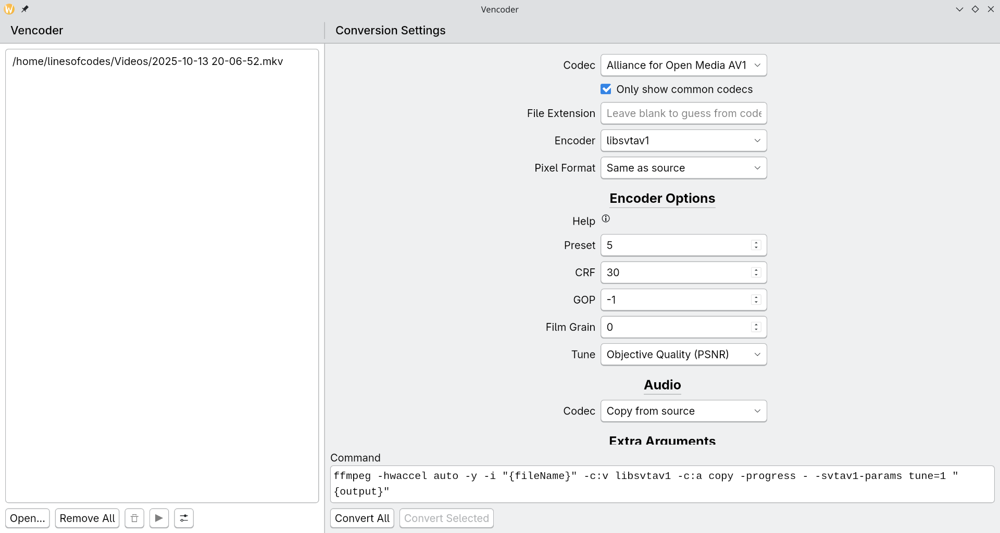

# Vencoder



_Screenshot taken on Linux with KDE Plasma, Version 0.1.3-dev_

A tool to interactively transcode videos using FFmpeg.
Uses Neutralino.js and Solid.js (I have skill issues and can't use Qt).

This app _tries_ to imitate KDE's Kirigami UI framework, and also makes use of
Breeze icons (Located in `./solid-src/public/breeze[-dark]`)

Vencoder is tested with FFmpeg 8.0.1, should be compatible with older versions
but is not guaranteed.

## Installation

Binaries are provided in the GitHub release, with `vencoder-release.zip`
containing all the files for Windows, Linux, and macOS.

### Windows

The GitHub release provides `vencoder-winx64.exe` which is a simple setup
program created with Inno Setup.

### AUR

Vencoder is available on the Arch User Repository as [`vencoder-bin`](https://aur.archlinux.org/packages/vencoder-bin)

## Regarding Performance

For some reason, Neutralino.js uses an awfully lot of memory _only_ on Linux,
The platform this application is meant to run best on. Maybe Tauri was a better
idea.

## Running

In the project's root, To run a basic development setup, you'll need to do the
following first:

```
pnpm install -g @neutralinojs/neu
cd solid-src
pnpm install
```

Then, in seperate terminals, run `pnpm dev` in the `solid-src` directory and run
`neu run` in the project's root.

To build, In the project's root, Simply run:

```
cd solid-src
pnpm build
cd ..
neu build
```

## Unimplemented Features

The Settings page doesn't work yet.

## Encoder Support

Vencoder will only support predefined options for "common" codecs. What is
considered common depends solely on the needs of the program's users.

Note that, not all of these encoders will show up in the program. Only the
encoders supported by your FFmpeg install will show up.

- [x] AV1
    - [x] libaom-av1
    - [x] librav1e (Partial support)
    - [x] libsvtav1
    - [ ] av1_amf
    - [x] av1_nvenc (Untested as I don't have a 40/50 series card)
    - [ ] av1_qsv
    - [ ] av1_vaapi
- [x] DNxHD (Does not provide options to deal with its pickiness yet)
- [x] H.264
    - [x] libx264
    - [x] libx264rgb (Untested, but _should_ work)
    - [ ] h264_amf
    - [x] h264_nvenc
    - [x] h264_qsv
    - [ ] h264_vaapi
    - [ ] h264_vulkan
- [x] H.265
    - [x] libx265
    - [ ] h265_amf
    - [x] h265_nvenc
    - [x] h265_qsv
    - [ ] h265_vaapi
    - [ ] h265_vulkan
- [x] VP9
    - [ ] libvpx-vp9
    - [ ] vp9_vaapi
    - [x] vp9_qsv
