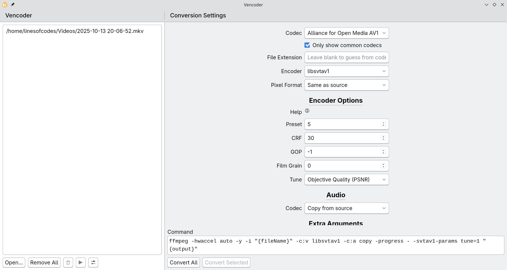

# Vencoder



_Screenshot taken on Linux with KDE Plasma, Version 0.1.3-dev_

A tool to interactively transcode videos using FFmpeg.
Uses Neutralino.js and Solid.js (I have skill issues and can't use Qt).

This app _tries_ to imitate KDE's Kirigami UI framework, and also makes use of
Breeze icons (Located in `./solid-src/public/breeze[-dark]`)

Vencoder is tested with FFmpeg 8.0.1, should be compatible with older versions
but is not guaranteed.

## Installation

The main dependency of Vencoder is FFmpeg, and for Linux platform, please also
have GTK 3 and `webkit2gtk4.1` installed.

Binaries are provided in the GitHub release, with `vencoder-release.zip`
containing all the files for Windows, Linux, and macOS.

### Windows

The GitHub release provides `vencoder-winx64.exe` which is a simple setup
program created with Inno Setup.

You can install FFmpeg by running `winget install ffmpeg` (or
`scoop install ffmpeg` or `choco install ffmpeg-full`)

### Arch Linux

Vencoder is available on the Arch User Repository as
[`vencoder-bin`](https://aur.archlinux.org/packages/vencoder-bin)

### Fedora Linux

Vencoder is now available on [Fedora COPR](https://copr.fedorainfracloud.org/coprs/linesofcodes/vencoder/)

Fedora Linux default `ffmpeg-free` package may also not support as much codecs
as you want to, Please follow the article on [RPMFusion](https://rpmfusion.org/Howto/Multimedia)
to install the full FFmpeg version.

If you wish to run the plain executable, Ensure the packages `gtk3` and `webkit2gtk4.1`
are installed.

## Common Error

If you see "Neutralinojs can't initialize the application server on port: 5540"

Neutralino.js hosts an internal HTTP server containing the app's code on your
machine, which for Vencoder by default uses the port 5540 _for the main window._
You can run Vencoder with a different port by providing the argument
`--port=1234`. On Linux, you can also run `sudo lsof -i :5540` to see which
application is using that port and close it.

Replace the port number with the available port on your machine, and do note
that, Vencoder uses the ports 5540, 5541, 5542 for the main window, progress
window, and settings window respectively.

## Regarding Performance

For some reason, Neutralino.js uses an awfully lot of memory _only_ on Linux,
The platform this application is meant to run best on. Maybe Tauri was a better
idea.

## Running

First, Install Node.js, and optionally `make`.

Install pnpm by following [pnpm's install guide](https://pnpm.io/installation)
or run `make configure` which will install pnpm with corepack and install the
front-end's dependencies for you.

Install Neutralino.js by running:

```sh
# This make sures that pnpm can install stuff globally
pnpm setup

pnpm install -g @neutralinojs/neu
```

Then, in seperate terminals, run `pnpm dev` in the `solid-src` directory and run
`neu run` in the project's root.

To build, In the project's root, Run `neu update` first to fetch Neutralino.js'
binaries, Then run `make build` for a regular plain build, or `make release` to
make a release build with embedded resources.

If you prefer not to use make, Run:

```sh
cd solid-src
pnpm build
cd ..
neu build
```

### Flatpak

You can run `make flatpak-install` if you wish to build and install the app
right away.

You can run `make flatpak-repo` then `make flatpak-bundle` if you wish to
create a `.flatpak` file.

## Unimplemented Features

The Settings page doesn't work yet.

## Encoder Support

Vencoder will only support predefined options for "common" codecs. What is
considered common depends solely on the needs of the program's users.

Note that, not all of these encoders will show up in the program. Only the
encoders supported by your FFmpeg install will show up.

- [x] AV1
    - [x] libaom-av1
    - [x] librav1e (Partial support)
    - [x] libsvtav1
    - [ ] av1_amf
    - [x] av1_nvenc (Untested as I don't have a 40/50 series card)
    - [ ] av1_qsv
    - [ ] av1_vaapi
- [x] DNxHD (Does not provide options to deal with its pickiness yet)
- [x] H.264
    - [x] libx264
    - [x] libx264rgb (Untested, but _should_ work)
    - [ ] h264_amf
    - [x] h264_nvenc
    - [x] h264_qsv
    - [ ] h264_vaapi
    - [ ] h264_vulkan
- [x] H.265
    - [x] libx265
    - [ ] h265_amf
    - [x] h265_nvenc
    - [x] h265_qsv
    - [ ] h265_vaapi
    - [ ] h265_vulkan
- [x] VP9
    - [ ] libvpx-vp9
    - [ ] vp9_vaapi
    - [x] vp9_qsv

## Logo

The logo of this program is in [./meta/abomination-inkscape.svg](./meta/abomination-inkscape.svg)

It is a V and the FFmpeg logo smooched together. Improvements are welcome, but no AI
welcome whatsoever.
